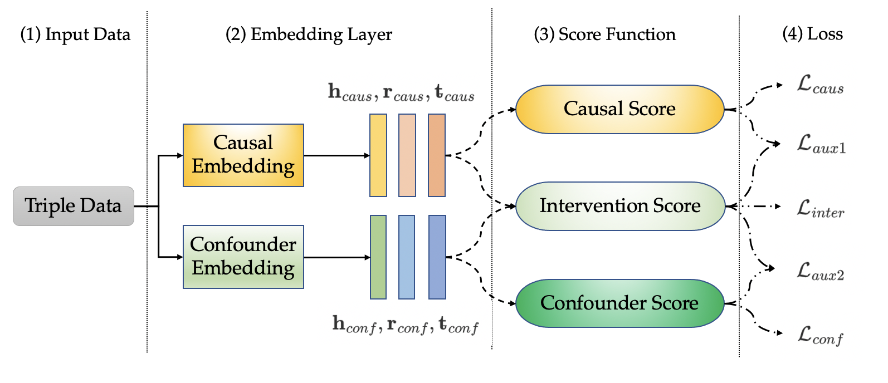

# Innovative Knowledge Graph Embedding for Exploring Unwinding and Causal Relationships in Predictive Modeling
* Put the paper link here * 

> In the field of artificial intelligence (AI), Knowledge Graph Completion (KGC) has emerged as a critical technique for enhancing a variety of downstream tasks. However, existing Knowledge Graph Embedding (KGE) models often struggle to accurately capture the structural relationships between triple data, leading to challenges in predicting missing triples. Addressing this issue, a novel approach to KGE is introduced, integrating the concepts of causality and embedding disentanglement to provide more stable predictions. This method introduces new training objectives, leveraging causal mitigation to estimate the influence of confounding embeddings while effectively capturing the structural nuances of triple data. The proposed model surpasses baseline models, achieving state-of-the-art performance in KGC by optimizing prediction accuracy. Additionally, opposition-based learning is utilized to enhance the exploration capabilities of swarm intelligence algorithms, ensuring faster and more efficient solutions for triple prediction tasks.

## Architecture


#### Code Structures
There are three parts in the code.
- **script**: The training scripts for the Model.
- **openke**: It contains the main files for the Model.
- **benchmarks**: It contains the data splits for different datasets.


## Dependencies

- ```Python 3```
- ```PyTorch >= 1.8.0```
- ```NumPy```
- All experiments are performed with one RTX 4090Ti GPU.

## Prerequisites
- **Dataset**: The baseline datasets FB15K-237 and WN18RR have been prepared in the `benchmarks/`, you can also use and upload your own KG datasets in the same form.
- **Environment**: Our code is based on the open-source project [OpenKE](https://github.com/thunlp/OpenKE), you need to following up the instruction in the OpenKE to build the running environment.

## 🚀 Training & Evaluation

The training script for **the Model**:
```shell
bash script/run_transe.sh # TransE score function
bash script/run_istmult.sh # DistMult score function
bash script/run_complex.sh # ComplEx score function
```

The default hyperparameters are predefined in the scripts, but you can fine-tune them as needed with care.

## Cite:
Please consider citing this paper if you use the code from our work.
Thanks!
